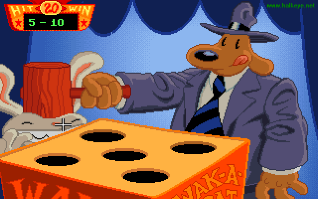

My design is almost completly done. I'm going to be enabling the sidebar links as i finish (re)doing them. I still have a spot at the top of the page i'd like to put an image or something in. but i really can't think of what i want there. My designs always look SOOO square. I defanatly need some help from some more experienced people to learn to change that...

Next up will be the computers page.

I do have to mention, I found this awsome utility to play some older games like Sam And Max.. Its called [Scummvm](https://scummvm.sourceforge.net/). Its a virtual machine for the scumm based games, which is a very big chunk of the old lucasart games, such as Sam And Max, Monkey Island 1 and 2, Day of the tentical, and Full Throttle.

Its defanatly a cool program, been replaying so many of my games since I found it. Well someone actually mentioned it to me, but same thing...

## Comments

**[shawn](#27 "2003-06-06 23:48:01"):** day of the tentacle kicks ass. So does sam and max, but DOTT even moreso. I don't like the background of the menubar on your website redesign. Gradients should be subtle, or nonexistent.

**[Gavin](#28 "2003-06-07 00:11:25"):** Yea, looks quite ugly.. well not ugly, but still, yea... but it looks alot better than it did..

I just am attempting todo things as best i can and learn from them, and i've learned alot today.. just not enough about images..

not that you'll see this.

**[shawn](#29 "2003-06-07 08:21:38"):** Oh, I saw it. Honestly, I think solid colors are the way to go. Gradients are especially difficult with text over them, because how do you pick a color text that looks good and is readable over the two extremes of color?

I was at a wedding last night, and the DJ was showing me the prototype for the sleeve for the CD his band was preparing to put out, and he had the same problem. My harsh design critic mode that architeture school created in me came out and I wasn't very nice about it. But I apologized afterwards, and if he takes some of my advice, his final product should look and work a lot nicer. Yay for being mean!

