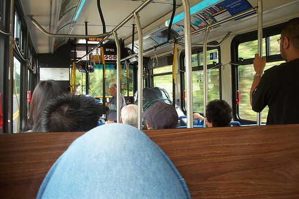

Wow, busses, specially richmond busses are like, such in a state of disrepair... Some of them have those cords for signaling stops disconnected because they broke off on one end or the other and nobody has tried to fix them yet.. Others have thier seats like splitting and repaired with duct tape....

Wtf is with those window things? they are like nearly impossible to open some days, then another window you barely touch it and it'll smoothly go open....

I wish I had a picture to post along with it, just to see the mess of richmond busses... I'll try to remember to grab one on the way home.

Although on the other hand, the people you see on the bus are really.. interesting.. The picture above is like.. a lady got on the bus with a few GIANT bags of something.. then once we got to the skytrain station, got on there tooo....
