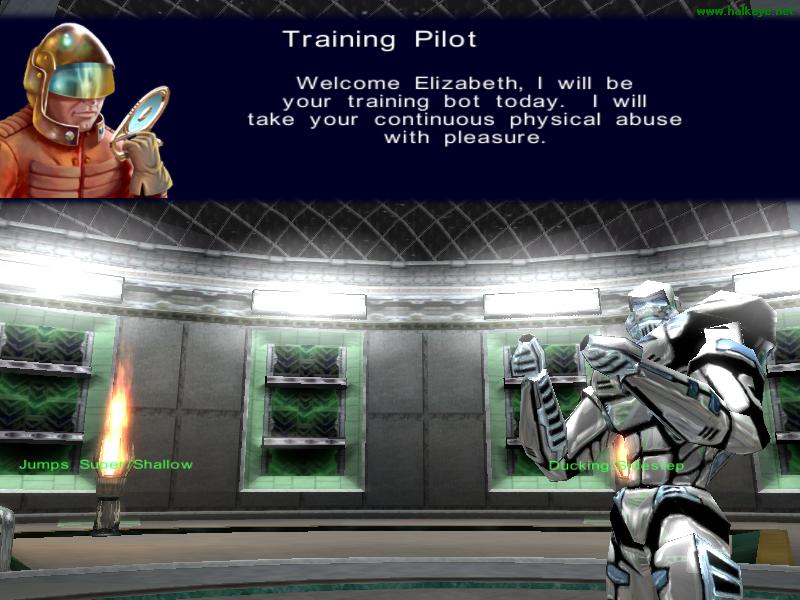

 How to put this kindly....

The game is constantly crashing on me. I have no idea if its my machine or the game itself.. twice now I've gotten unrecoverable errors.

I had high hopes for this game, even with people telling me how bad it was.

But I did manage to get one screenshot off using the handly little [Clipper](https://hot.ee/mardu123/clipper/) application.

Now, when I started the game, I was quite impressed to hear the familiar sound of One Must Fall 2097's music.. Remastered/etc of course, but it still had the familiarness to it.

This game's default controls (I so rarely change defaults as its usually the default for a reason), are absolutly horrendous. The attack buttons are all mashed into the corner (A, S, Z, X) and Defend (D) and Jump (F) are not layed out at all, specially with the default move keys as the arrorws. What game actually uses the arrors as the real move keys anymore.... wait, I guess most do.. but still.

My biggest beef was the special moves.. you barely learn how todo anything in the tutorial (as much of the tutorial as I could figure out), and if you are anything like me, after quickly being frustrated by the tutorial/practice, you move on to the real single player to start out, only to find out that the computer keeps like, pulling off these weird moves (in my case, like flame throwers and throws and flips and stuff). I had to totally button mash to find out anything, and even then, most of it was a fluke, or repeated basic punches.

Even the menus had things to be desired, although I do think it wasn't that bad. Alot of the menus had arrows to click on, except in fact you needed to click on the text beside it, the arrows did nothing, yet in other cases, they did thier obvious jobs.  

While trying to figure out things, I accidently double clicked on things a few times, only to find myself stuck with my fighter/robot without being able to easily go back.

  

All in all, I didn't have a very good experience with this game.

  

(yes, more posts to come about other recent games, I have them in rough in notepad, just havn't had the ... motivation to clean them up and post...)
