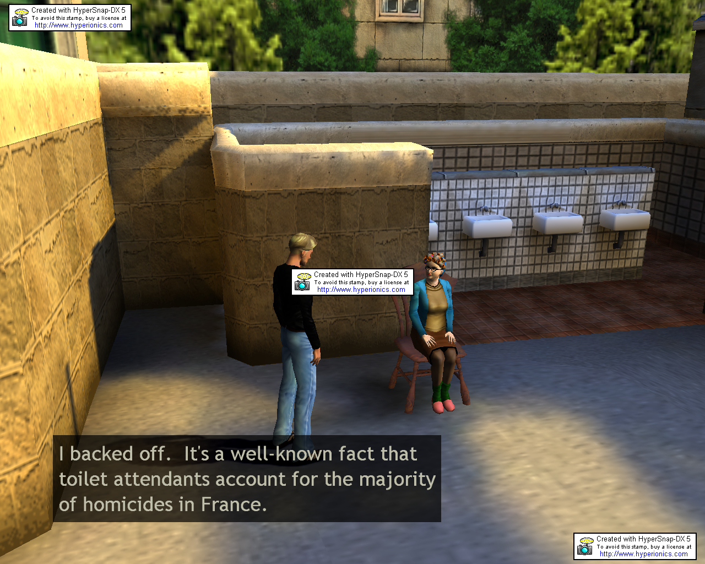
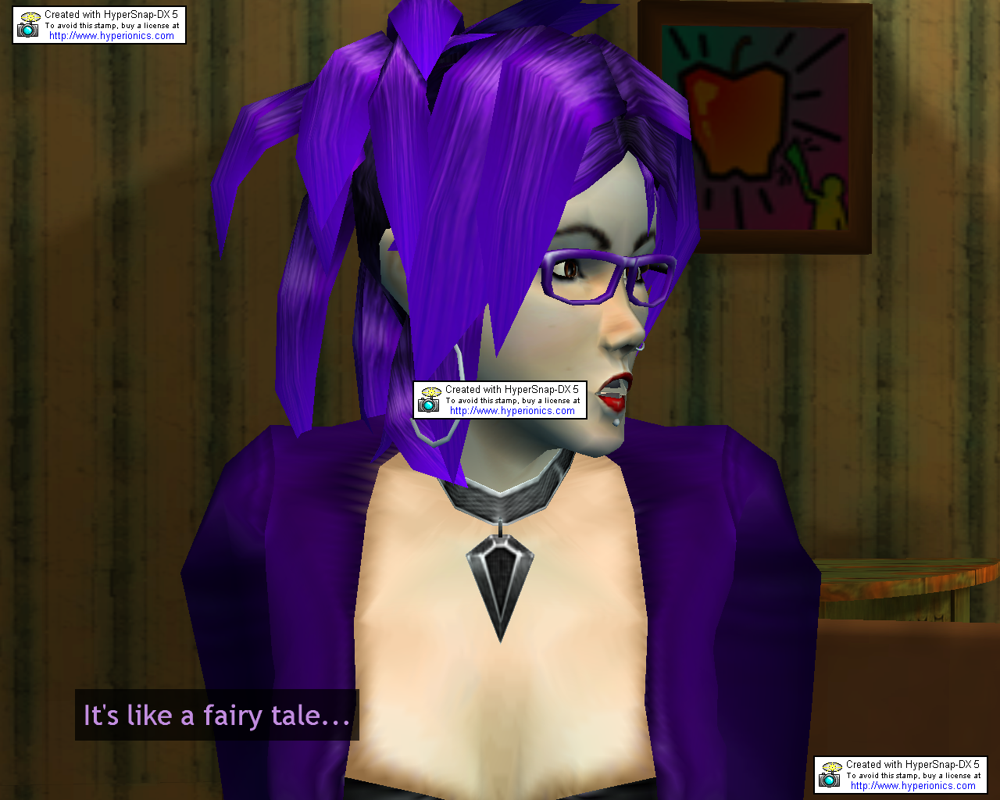

-Okay, so I finished Broken Sword 3 a few days ago. I really liked it, the dialog was awesome.
Actually, I think the Dialog is the best part of the game. I'm not much of an audible laugher, but I was laughing A LOT with this game. The stupid one liners. The interaction between other characters, specifically George and Nico.. Cest Magnifique!!!
The descriptions of objects are so much fun, it actually makes it worth while to look at every object, even if you never use the object at all..

The actual gameplay, well, interface, it .. to say the least, sucks.
Camera angles switched positions, so you suddenly were running back the way you came.
No way to skip over dialog you heard before... on hard puzzles, I ended up trying every item in the inventory, and hearing the "unique" "you can't do that" type lines over and over again, were annoying.

Makes lots of references to the previous broken sword games (I only remember playing broken sword 2), which is kinda disappointing, since I read its been about 6 years between #2 and #3, it was one of the first games I played when we got the 300 way back then..
Storyline was good... but well had some holes.. just where it was lacking, and in the end, it didn't quite clean everything up... so much so you'd expect to see another one.
I ended up only needing to check the walk-through 3 times, and each were because I was impatient and didn't feel like figuring out one tiny little aspect of a puzzle.

I love how some of the game screens include pop culture references. I found one girl working on a computer that had MSN on it :)
It was really enjoyable to go through the storyline just for that kind of items. And all the main characters were well modeled, In fact the girl... I can't remember her name, but the girlfriend, the goth girl, was modeled soo well and developed, I actually had a tiny little crush on her.. okay, I just thought the face was extremely cute.

I think it is one of those times where it would have been made a better movie than game.. It had a solid idea for the story...

(Man my writing style sucks. I need to improve that sometime)
