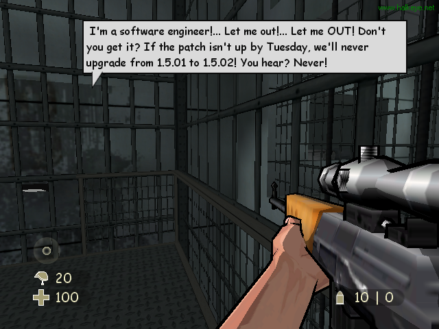

Finished [XIII](https://www.xiii-thegame.com/) tonight. I have to say I was kinda disappointed. Well.. Not really, as it was advertised on the bus and on tv, so I didn't have very high hopes for it anyways.

Hrm, what to say...

Graphics were pretty good, I can't say I'm a big fan of the cell shading games, but this actually pulled it off quite nicely. All the maps were awesomely textured with a high attention to detail. Yea, It was beautiful, I'll give it that. And I really liked the comic style subtitles, it made the subtitles that much more useful, and it helped to figure out where voices were coming from, as I don't have my 4 speakers setup, only the front 2, and with that, it can be difficult sometimes.

Story... Well, without any major spoilers, lemme just say, a GAME SHOULD **NOT** END IN "TO BE CONTINUED". People pay 2 or 3 times more for a game than a movie, and shouldn't get that same treatment, for $60 cdn, there should be an ending. Although all throughout I was hooked to the story, I kept wanting to find out who Number I was. I belive more or less right at the end you find out who it is (although the game's chart doesn't actually say it), but as you do, it goes _TO BE CONTINUED_.

Voices. I can't believe this is actually a big deal at all, but apparently since both [Adam West](https://www.imdb.com/name/nm0001842/), and [David Duchovny](https://www.imdb.com/name/nm0000141/) ([Rest of the Cast](https://www.imdb.com/title/tt0365948/)) had staring roles in the game. I honestly don't think they were right for the roles. Specially Adam West as he will be ever known as batman to me. And well, the big D.. Well he had a very small part, even if he was the staring role. The main character didn't speak much, but was spoken to a lot.

I guess I'm looking forward for whatever comes next, but I was majorly disappointed that it sunk to that level.
