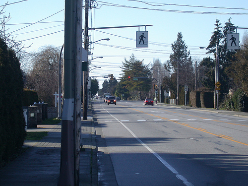
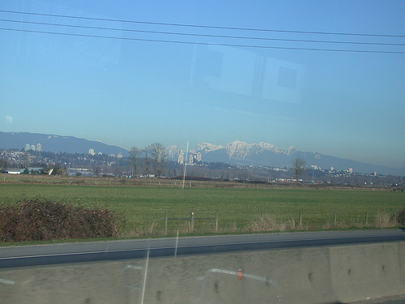

Vancouver hit 10°C today.

It was such a beautiful day today too. If it wasn't for the migrane it would have been a perfect day.

You could see just about every detail about the mountians, so crystal clear today, not a cloud in the sky.

Even had an awesome night. Clean, nice, on the warm side, etc.

  

Yea, lacking in post content, but I was just impressed by some of my pictures tonight. Specially finding out that my (dad's) camera can actually do [movie files](https://www.flickr.com/photos/halkeye/4200749271/).
