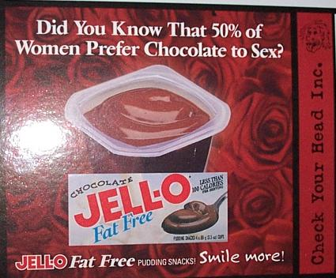

Not that I'm really bitter about being alone again for this Valentines day (Alone being alone, not without girlfriend, thats not that big of deal), but the big deal that everyone else makes of it.

In the past, I've had to bus home from work, watch all the girls with thier bouquets of flowers, and be all like "I WANT ONE", then last year I was blessed enough to have classes that day, so I wasn't truely alone.

But this Year, well, I seem to be chipper-er-er-er, so I shoudln't be so down as I was last year. But I still can't say I'm very impressed by this very shallow holiday.

Tonight I heard about some extravagant plan layed out by a friend for her boyfriend, which only got me downish as I know I can't even count on parental units this year to do anything, not that I want them to, but after hearing other friends and thier parents, I'm sort of envious.

At least, somehow, I've managed to avoid all the commercials and other advertisments trying to push all the material goods that go along with valentines day. I know its been said before, and I'll say it before. Why is the symbol of love the bloodiest organ of them all? Why not a cute kitten? or a skull and cross bones? Why the heart? Why Chocolate? Well I know why chocolate. But still. 

I donno, I guess I am bitter, I had my hopes up for a bit.

At least it not going to turn out all bad, I got alot of jobs I want to apply for, and I might as well do it when everyone else is so busy. No distractions.
