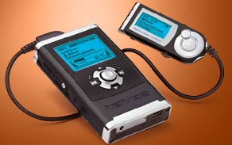

I think Chad’s right.. I should get this...

Its alot better than the IPod from what I hear, which seems to either die for people, or need proprietary software, and all that stuff. Doesn't come with any accessories, not even a usb cable. And the HP-120 is almost exactly the same price, if not cheaper.

I know the M and a few others swear by thier IPod, but this seems like it has so many more features I'd use.

At least I'm going to go about buying a few cds and soundtracks.
* Kill Bill Vol 1 soundtrack
* Punisher
* Nelly Furtado (Something)
* PInk - Missundaztood
* Punk O Rama 7
Need to figure out some good electronic stuff as coding music too.

Defanatly have to think of others.. I've waited so long to buy cds.

This whole lot might be a fun lot to blow my first pay cheque on eh?

## Comments

**[Lisa](#42 "2004-04-21 09:29:07"):** Mmmm I want this. I'm using an Archos now; if that thing came in 40gig I'd almost definitely do it... 16 hours, Mine gets about 8 and I thought that was just about brilliant. ;)

**[Gavin](#43 "2004-04-21 09:39:59"):** How is it with me, whenever you ask, i end up getting/giving?

Speak and ye shall recieve:

https://www.iriveramerica.com/products/iHP-140.asp

I like it 'cause of its size, capacity (archos is 20 no?) and has the radio built in for the morning commute (i like the morning people).

**[Lisa](#44 "2004-04-21 21:14:57"):** *drools* Thanks for answering all my questions Gavin. You're great. Now I'm going to have to spend $500.00 though... *sighs*

