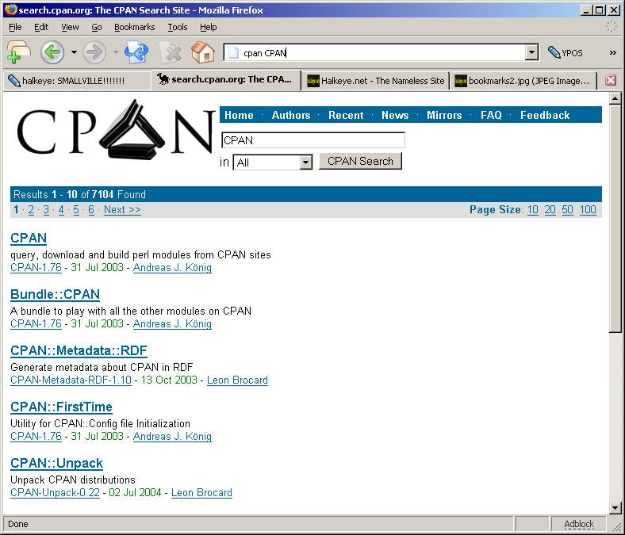

  
if you goto manage bookmarks, then new bookmark  
you can set keywords for bookmarks  
then if you put a %s in, you can do  string

  
https://search.cpan.org/search?query=%s&mode;=all  
keyword: cpan  
"cpan Module::name"
And Voila!!!  

  
Nice and simple cpan searching
  

(Tip was originally mention to me by [Jordan](https://j0rd.ath.cx))
