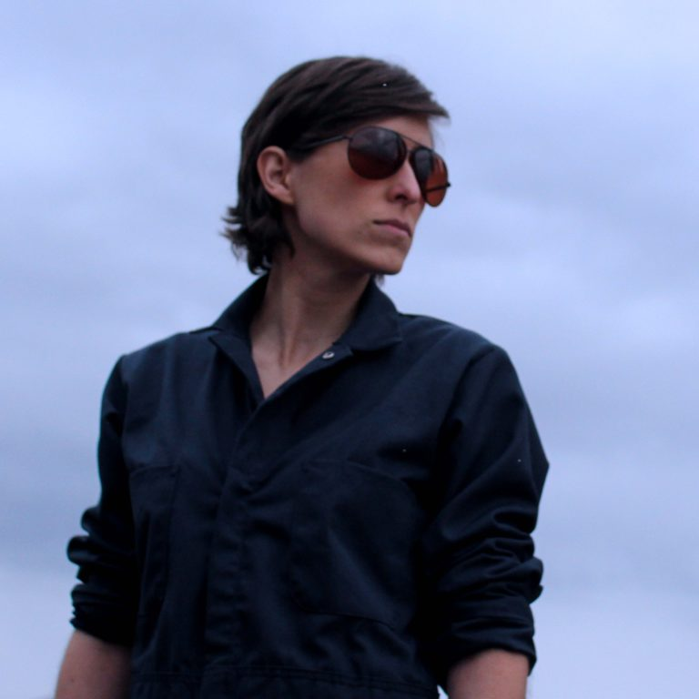

Only a week later. I’m getting way better at this.

Last weekend my friend [Joanna Gaskell](https://www.joannagaskell.com/) stared in this fringe festival play called [Grounded](https://thecultch.com/event/vancouver-fringe-festival-2016-presents-grounded-3/). Other than knowing it was about a female fighter pilot, I went in not knowing anything else about it. I’ve been finding the more I do it, the more I enjoy the entire experience. This would also be my first experience with anything fringe festival related.

So a friend and I got tickets for opening night, arrive at this tiny little theater. Once I got inside, realized its was this tiny little theatre and had a moment of panic. What did I get myself into. Buuuut, right from the opening sequence, all the way to the end, it was such an amazing experience. It turns out she was in was in this (mostly) one woman dramatic play. I’ve never seen anything like this before. I had worked on big productions as a teen, but this was just a simple set, one and a half costumes, and Joanna.

I was constantly surprised how emotional I felt throughout the performance. Joanna really nailed everything. She starts off describing her emotional state as a pilot, flying through the sky, being a god in the sky, to meeting someone awesome, having a kid, all the way to the roller coaster ride that was being turned into a drone pilot.

I don’t really want to say much more, other than I laughed at parts, felt uncomfortable at parts, even cried at parts. Was such an amazing ride.

There’s a few more shows this upcoming weekend. I highly recommend [grabbing tickets](https://thecultch.com/event/vancouver-fringe-festival-2016-presents-grounded-3/).

I liked it so much I’m actually going to check out another fringe show. Look at me. Two whole fringe shows in one year.
