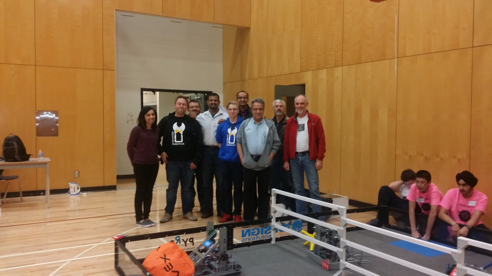

So yesterday I ended up at helping judge a [high school robotics competition](https://www.robotevents.com/robot-competitions/vex-robotics-competition/RE-VRC-15-3684.html) organized by the [local robotics group](https://www.pyrs.ca/), but lets rewind a bit.

In september, my friend Daruvin contacted me. He in conjunction with [Penguin Robotics](https://penguinrobotics.ca/) was helping to put together workshops to help the high school students learn to program for the robotic systems.

The penguins were past world competitors and had a lot of experience, but they wanted more people to help out the large number of attendees, plus would love people with industry experience to share stories and such.

As I love to mentor and build up people, especially kids, I very quickly signed up. Even got work to sponsor.

<blockquote class="twitter-tweet" data-lang="en">
Honored to sponsor <a href="https://twitter.com/penguinrobotics?ref_src=twsrc%5Etfw">@penguinrobotics</a> RobotC Workshop in YVR last weekend - kids rule! Thx <a href="https://twitter.com/halkeye?ref_src=twsrc%5Etfw">@halkeye</a> for the hookup. <a href="https://t.co/e5lqtcQzvU">https://t.co/e5lqtcQzvU</a> <a href="https://t.co/pTrMsUvse7">pic.twitter.com/pTrMsUvse7</a>
&mdash; Sauce Labs (@saucelabs) <a href="https://twitter.com/saucelabs/status/780858352251334656?ref_src=twsrc%5Etfw">September 27, 2016</a></blockquote>

Last month due to traveling I wasn't able to get involved, but when the tournament rolled around and again I was asked if I was up for helping judging I promptly signed up.

We had about 8 people, so that easily allowed us to have pairs. We had 3 groups of 2 setup at tables so the various clubs could come and get reviewed and judged. Some were really amazing and had been doing this for a long while. Others were just starting out and it was a bit better to give them feed back instead of worrying about judges.

The other judges were outside watching the games, and watched how the various students/drivers performed.

We all kinda rotated at both sections.

During the afternoon, the teams were no longer random, but instead they got to make alliances and go through playoffs to see who would be allowed to goto the next level. We took this opportunity to get together as judges and compare all of our notes.

Once we were able to compare notes and pick winners for each categories, we were able to go watch the finals.

The finals were absolutely tense. I saw one teacher get so excited she was jumping around. It turned out this was the first year her school got to compete or something. She's been fundraising a while to get it started. Turns out one of her groups won. She nearly collapsed and was in tears. It was so awesome to watch.

Finally everything was announce. Top winners in playoffs. Top driver in skill challenge, top autonomous robots in skill changes, all 5 judges awards. Some teams played off winning as it was nothing, but you could tell all of theme were excited about winning. I didn't see any poor losers at all. Even the final game of the playoff you could see the losers thinking about how to improve to next time.

Last bits were the most impressive to me. Everyone of course ran off to clean up the tables and robots of their owns, but as soon as that was over, many kids from many different schools, not just the hosts, came back and helped clean up the event stuff. I mean sometimes it was ridiculous that we had 5 kids doing the simplest tasks, but they were all having fun and things were getting done.

I stuck around till the very end, helped with cleanup wherever I could. I had so much fun. I'll admit the finals and the cleanup were more fun to me than the actual judging, but i enjoyed all of it and would do it again.

I'm so looking forward to next weekend when I'm getting involved with the second [workshop Penguin Robotics](https://www.facebook.com/events/1102273973226154/) is putting together. This time they'll actually have the game field, and two groups going, one for novice and one for advanced. I'm hoping some of my teacher friends can get more involved as well.

I know this is super scattered, but i'm still excited and just thinking of everything, but I learned that a school would need about $1000 to get the basic kit together to field a team. Of course they would still need workspace and teachers/mentors and everything but I figure that's something more individuals/companies could donate to schools to help them get started. I know I'm going to look into it. Too bad I haven't kept in touch with my high school at all, it would have been cool to see them there. I think my shop teacher has long since retired too.
