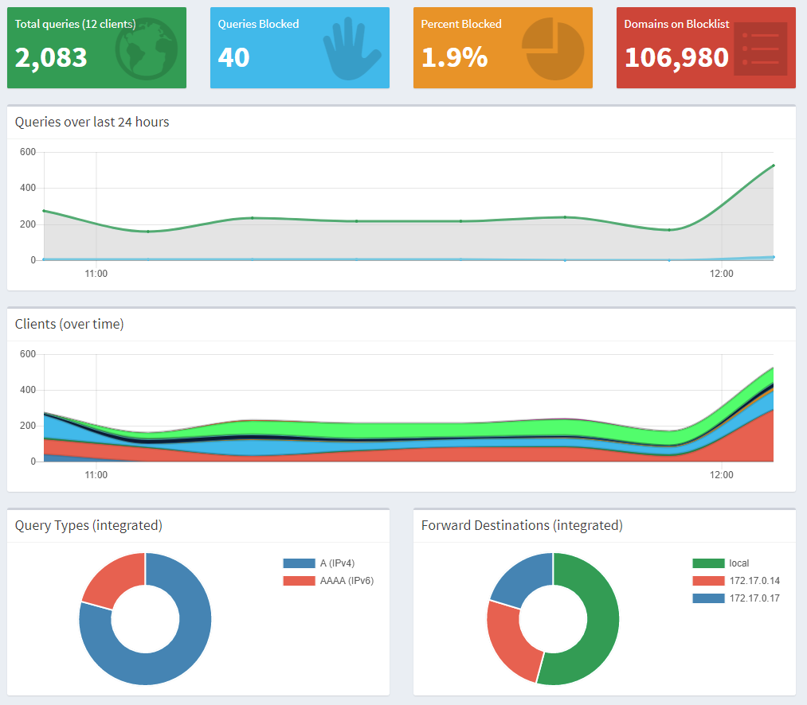
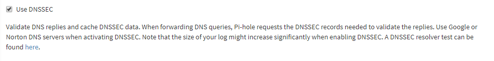

My home network has been having issues. Mostly it seems between the [chromecast packet flooding](https://www.engadget.com/2018/01/16/google-chromecast-messing-wifi-connections/) bug and something to do with WiFi + android 8.1, but things will drop connections. I've eventually had to make one WiFi for my important stuff, and one for the random gadgets (which I probably should have done anyways). I'm not certain either of these things were happening, but they seemed to line up.

But on top of all that I wanted to try moving DNS off of my router and onto something I had more control over. I had heard of [Pi-hole](https://pi-hole.net/) as a solution for system level ad-blocking, I was mostly hoping it would help my phone cause ads on mobile webpages really suck cause of load jumping around the page, I can generally ignore ads the rest of the time.

Docker has the usual advantage of things working out of the box. No configuring and everything because someone else did it for me.

So off I go to find an install of [Pi-hole](https://pi-hole.net/) that works, and I can poke around with. It didn't take long. https://github.com/diginc/docker-pi-hole seems to work really well. Installed it, looked pretty good. Restarted it with ports mapped so I could play with it. Still success. DNS seemed fast and zippie. Fully usable.

But I wanted more. I was reading about dns-crypt, and had heard it could encrypt your DNS requests so your ISP and such couldn't actually track what you were doing (Not that I wanted to hide, but I liked the idea of it).

So off I go. I learn about dnscrypt-proxy, and quickly found a nice docker image. https://hub.docker.com/r/rix1337/docker-dnscrypt/

So off I go, seems pretty easy to set up. Just download, run, and point at the local proxy (there's a list on the docker hub page).

Nope, not that simple. Cause silly me, it needs port 53 as well. Okay, no problem, let me use another port and tell pihole to use that. hrm.. nope, the runtime configuration thingie eats up the '#' so I can't specify port like you can in the dnsmasq config that pihole uses. Okay. Okay, lets try a ip address alias. That seems to work, so pihole takes the main ip, and dnscrypt takes an alias? Sweet! I can manually query things on it, time to hook everything up together.

Hrm. Nope, wall again. Apparently my docker setup can't talk to anything but the main ip. I'm guessing its firewalld which I'm hoping to get rid of once I reinstall my system. Okay, what else can I try now?

After a bunch of reading online, I found out you create a docker network, and the various services can talk to eacho ther without needing to expose ports out to the rest of the network. That sounds perfect. Oh, wait, you need to resolve the addresses inside the containers, which totally won't work for dns because dns wants the ip so it can resolve. Close, I mean it would probably work because docker has its own dns proxy, but again you can't pass non ips to the pihole runtime configs. Okay whats next.

Lastly I found a quick script using docker inspect. `docker inspect --format='{{range .NetworkSettings.Networks}}{{.IPAddress}}{{end}}' $container`

I really wasn't sure this would actually work because in theory ips could change every time it starts up, but it seems to allocate the same ip if possible, so kinda lucked out. So now I had Pi-hole talking to dnscrypt-proxy, which meant my lookups were encrypted. Yay!

Okay, whats next? Next I want to get dnssec working again. Not the end of the world for Canada. Our government and ISP are not supposed to mess with dns results, but I wanted it anyways. Plus its nice to have when the time comes.

Oh Awesome. Pi-hole has a option for it. Time to enable it.

Enabled, success. Time to walk away.

Oh wait, things are failing. Why are they failing?

Long story short, the version of Debian that was bundled with the Pi-hole docker image was super old. So the version of Dnsmasq was super old. It wouldn't handle any cloudflare based dns requests that had dnssec enabled (which my domain does). Okay, now what? Started to dig into how the docker image was built. Looks like it actually wasn't that hard to get it running with [latest stable](https://github.com/diginc/docker-pi-hole/pull/221) instead of the old stable.  Between the [work I did](https://github.com/diginc/docker-pi-hole/pull/221), and a different PR the author did, we managed to get it upgraded to Debian stretch that afternoon. I tried the latest build and success, everything was resolving again. Time to walk away right?

Wrong. Suddenly I started getting all these cron errors about mirrors.fedoraproject.org not resolving. Turns out Dnsmasq also had an issue with the certs for that domain. Okay, disable dnssec and start researching again. Turns out again Dnsmasq had a new - newer version that had it fixed, but wasn't in Debian stretch. Turned out actually to be a pretty easy fix. I had never tried to install a testing package in stable before, but for Dnsmasq that didn't really have dependencies, it was super easy. And thus my [Pi-hole image was born](https://github.com/halkeye/docker-pi-hole/blob/master/Dockerfile). Sadly it would be nice to have it in the base image. And one day I'll clean up a patch and get it submitted, but I'm happy to be totally encrypted and verified dns now.

This post turned out to be way more rambly and disconnected than I expected, but I'm very happy with the results. I now have systemd keeping up dnscrypt (primary and backup) and Pi-hole and now have fast stable dns and my phone is no longer randomly disconnecting everything. I'm pretty happy with the results. Plus pretty graphs.
